#  AT - Labor
## Use Case Gerald
#
#
#
#### Aufgabenstellung
Die Aufgabe war es, technische Lösungen für die Wünsche von Gerald unter Einbeziehung der gewählten Räume zu entwickeln bzw. anzuwenden. 
Der gewählte Raum ist das Schlafzimmer. 

#### Kurzbeschreibung Klient: Gerald
Gerald hat eine starke körperliche Einschränkung und eine Hörbeeinträchtigung. Er ist auf Pflege angewiesen und kann
Klänge wahrnehmen. Er würde gerne eine gewisse Autonomie zurückerlangen und seine Umgebung (z.B. Licht, Jalousien,
Musik) steuern können. Darüberhinaus würde er gerne Klänge/Visuals erzeugen können und sich die Zeit mit
Computerspielen vertreiben. Er möchte gerne im Internet surfen oder am Smartphone mit seinen Freunden kommunizieren
können.

#### Lösungsansätze
    
    - AsTeRICs Grid
    - IRTrans
    - Eingabegerät FABI
    - Eingabegerät Tobi
    - Betriebsystemeinstellungen für Accessibility
    
# AsTeRICs Grid
Asterics Grid ist eine freie Software für ACC-Anwendungen. Durch dieses webbasierte Tool ist es möglich,  Klientenspezifische Lösungen zu kreiren und dadurch den Lebensstandard von Personen mit gewissen Einschränkungen zu erhöhen. Im Zusammenspiel mit dem AsTeRICS Framework kann die Realisierung zusätzlicher Funktionalitäten wie Umgebungs- oder Computersteuerung ermöglicht werden.  
In diesem Grid-Layout kann man verschiedene und verschieden-viele Elemente hinzufügen. Das Homegrid für den Klienten Gerald hat die wichtigsten Funktionen, wie z.B. Licht und Heizungssteuerung. Weiters kann er den Fernseher bedienen und eine Visual-Smart-Glühbirne steuern. 

Die einzelnen Elemente können individuell eingestellt werden und mit der ACS (Asterics Configuration Suite) kommunizieren. Jedem Element kann eine oder mehrere Aktionen hinzugefügt werden. Für die meisten Elemente wurde eine eigene Asterics-Aktion ausgewählt, welche mit der ACS ausgeführt werden kann. 

    
Um die physischen Umgebungselemente wie Licht, Jalousie, Temperatur, usw. anzusteuern, braucht man ein Tool, welches eine Haussteuerung anbietet. Es wurde das Programm OPENHAB herangezogen, weil es zu diesem Tool ein fertiges Asterics-Plugin gibt. 

    
In openhab kann man seine eigene Homesteuerungswebseite desigen und die entsprechenden Geräte konfigurieren. Für unsere Anwendung wurde das vorgegeben. Als Beispielwebseite ist folgende gezeigt:

    
Wichtig für die Konfiguration ist die richtige IP-Adresse (oder URL). Diese ist unter dem Hostnamen einzutragen. Wenn man auf dem eigenen Rechner bleiben möchte muss man "localhost" eingeben. Ansonsten ist im Living-Lab die URL fhtw-building-control.technikum-wien.at anzugeben. 

Um den Wünschen des Klienten gerecht zu werden, musste die Steuerung des Fernsehers und die der Visual-Glühlampe anwendungsfreundlicher gemacht werden. Dies wurde mit der IRTrans-Komponente realisiert.  Dies ist ein Gerät, welches Infrarot-Befehle "erlernen" kann und so das Senden/Empfangen von IR-Signalen ausführt. 

    
Weiters macht das Plugin "IRTrans" in der ACS das Kommunizieren mit dem Grid wesentlich leichter/schneller. 

In diesem Plugin trägt man die eingelernten Befehle, sowie den Namen der Funktion ein. In diesem Zusammenhang heißt die Funktion (Fernbedienung) "toshiba" und es gibt 18 Arten den Fernseher zu bedienen. 

 

Dieser Befehlsnamen bzw. der dazugehörige String muss dann im Asterics-Grid für das richtige Element eingetragen werden.

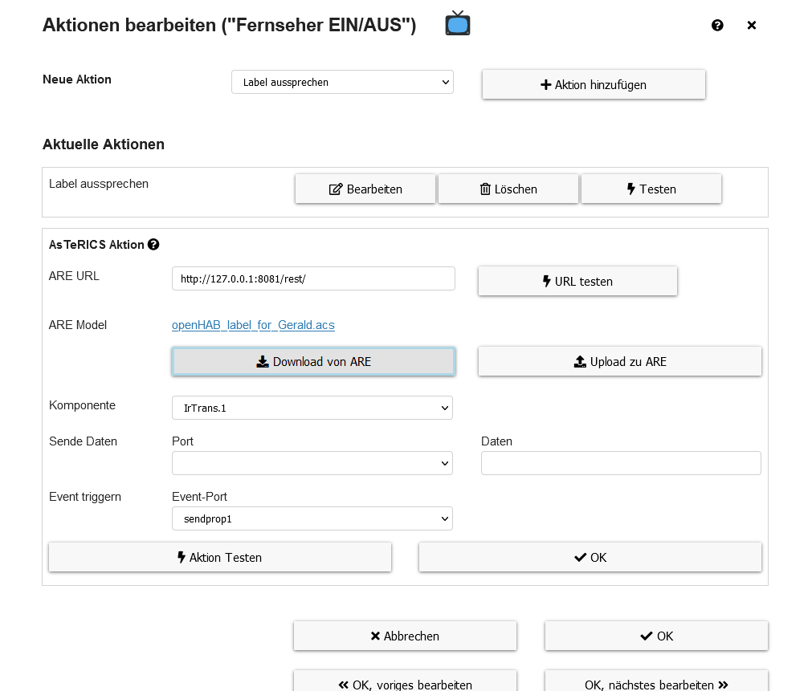

    
    
Um die UX (User Experience) und Anwendungsfreundlichkeit des ganzen Systems zu testen wurde der FittsTask angewandt. Dieses liegt dem allgemeinen Fitt's Law zugrunde. Es ist ein prädiktives Modell, welches die Dauer für menschliche Bewegungen bei Zeigeaufgaben vorhersagt bzw. auswerten lässt. Dabei verwendet es die Distanz zum Ziel, sowie dessen Größe als Parameter
Bei dem Versuch wurde drei verschiedene Arten verwendet um sich durch das UI zu navigieren. 

    - MouseButton
    - Dwelling Methode
    - Keyboard/Fabi-Button
        

### MouseButton

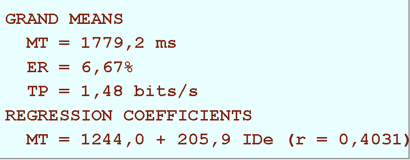

### Dwelling Methode

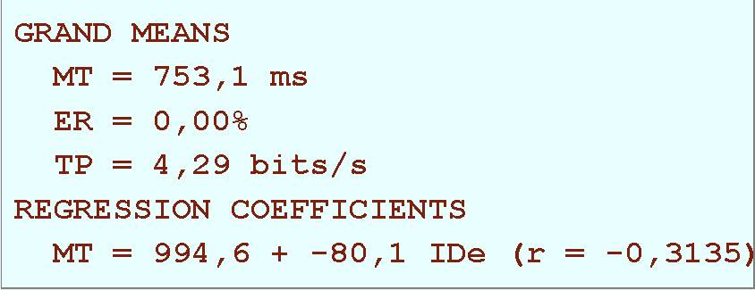

### Keyborad/Fabi-Button

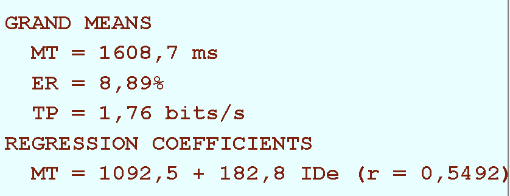

Wie man eindeutig sieht hat die Dwelling-Methode einen wesentlich höheren TP und die am anwendungsfreundlichste Methode ist. Die anderen beiden Methoden sind hier fast ident. 
Bei der durchschnitllichen Dauer zur Erfüllung einer Bewegung, kurz MP, schneidet auch die Dwelling-Methode am Besten ab. 

# Eingabegerät FABI

## 1. BESCHREIBUNG
FABI - Flexible Assistive Button Interface, hat bis 9 externe Tasten und kann auf Windows-PC, Mac-Computer, 
Tablet oder Smartphone per USB-Anschluss verwendet werden.
Mit dem FABI sind Computerspiele, im Internet zu Surfen, E-mails schreiben und vieles mehr möglich. 
(file:///C:/Users/Dana/Downloads/FABI_UserManual.pdf)

## 2. DIE KONFIGURATION

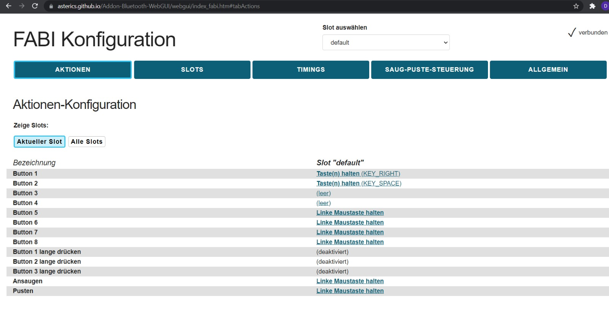

### 2.1. Auf den Online Seite würde die Buttons konfiguriert
(https://asterics.github.io/Addon-Bluetooth-WebGUI/webgui/index_fabi.htm#tabActions)

Button1 wurde erstellt als KEY_RIGHT um im Asterics Grid nach recht navigieren zu können, 
und der Button2 als KEY_SPACE, damit ist die normale Leertaste möglich bzw. einen Befehl im Asterics-Grid auszuwählen. 

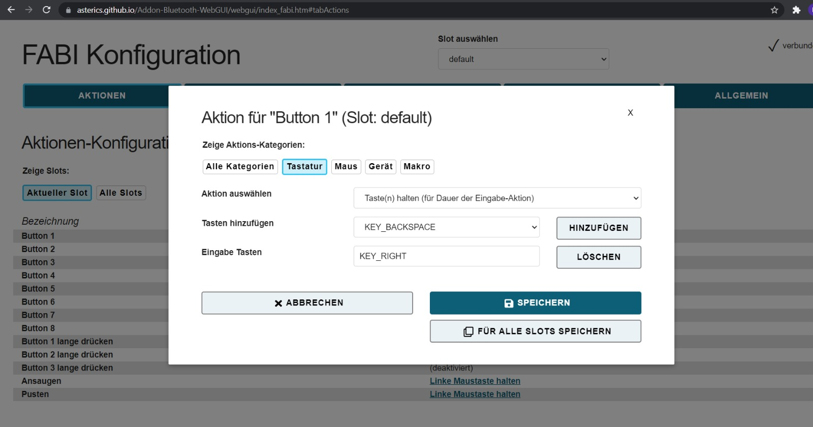

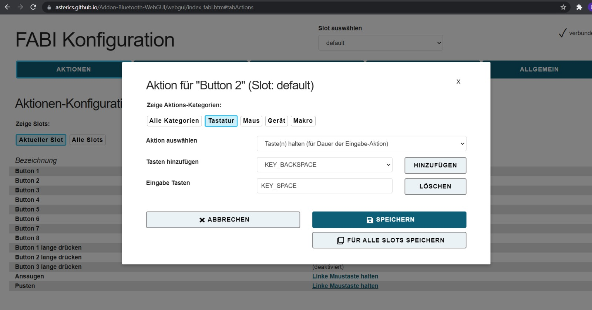

### 2.2. In Asterics Grid würde auch bei Eingabeoption, für das Fabi konfiguerieren mussen.
Asterics -> Eingabeoption-> Sequentielle Eingabe

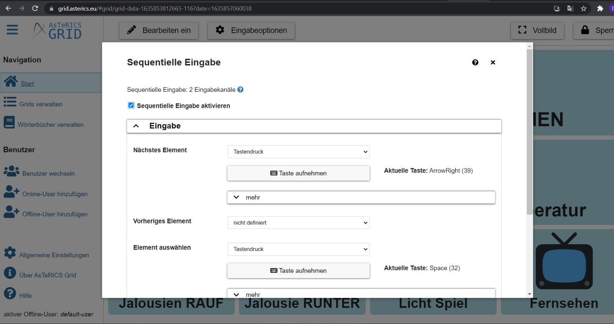

## 3. DIE VERWENDUNG 
Da der Klient nur die große Zehe bewegen und den rechten Arm leicht heben/senken kann, hat man zwei Knöpfe genommen.
Der Button1 wurde gedacht um nach rechts navigieren zu können(evtl. mit der Zehe).  
Der Button2 wurde gedacht um "Space" nutzen zu können (evtl. rechter Arm).

# Accesibility Einstellungen
Gerald kann mit seinen Augen, Kopfbewegungen und leichtem Heben / Senken seiner rechten Hand kommunizieren, weshalb wir Tobii EYE Tracker 4C,Click2Speak und Fabi verwendet haben.

## Beschreibung:

Der Tobii Eye Tracker 4C ist eine kleine Hardware, die man am Bildschirm per USB am Computer verwendet werden kann.Mit der Nutzung von Tobii hat man allein durch Augenbewegung Gelegenheit zur Unterhaltung (wie Maus und Tastatur) bzw. die Kommunikation mit anderen. 

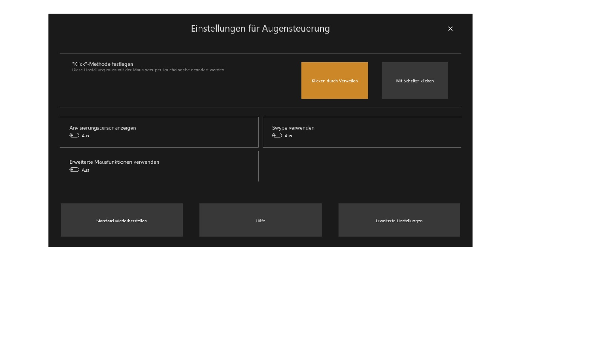

Click2Speak - ist eine virtuelle Tastatur, die mit einem Swiftkey Predictive Typing System erstellt wurde. Diese unterstützende Technologie eignet sich perfekt für Patienten mit Zerebralparese, Verletzungen des Wirbelkanals, Muskeldystrophie und anderen Problemen mit der motorischen Mobilität, wo auch unser Klient Gerald dazuzählt. Die Click2Speak-App kann auch von Personen verwendet werden, die Probleme mit herkömmlichen Tastaturen haben.

Diese App ermöglicht es Benutzern, Texte in beliebigen Anwendungen einzugeben. Um mit Click2Speak arbeiten zu können, benötigen Benutzer einen alternativen Controller - einen Fußschalter, einen Kopfbewegungssensor oder ein Eye-Tracking-Gerät. Benutzer können aber auch herkömmlichen Mausmanipulator verwenden.

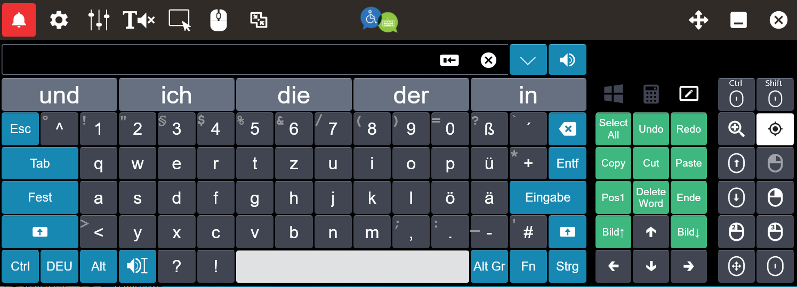

## Computer:

Mit Fobii Eye Tracker kann Gerald im Internet surfen, ein Spiel spielen, eine E-Mail auf seinem Computer schreiben und/oder Visuals erzeugen (Phillips Hue Go oder Infrarot Lampen).

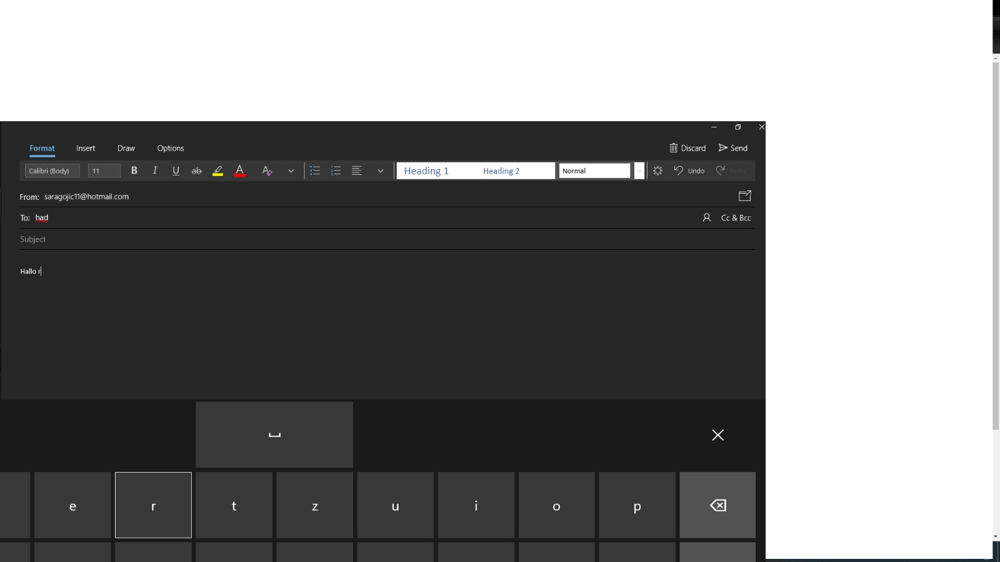

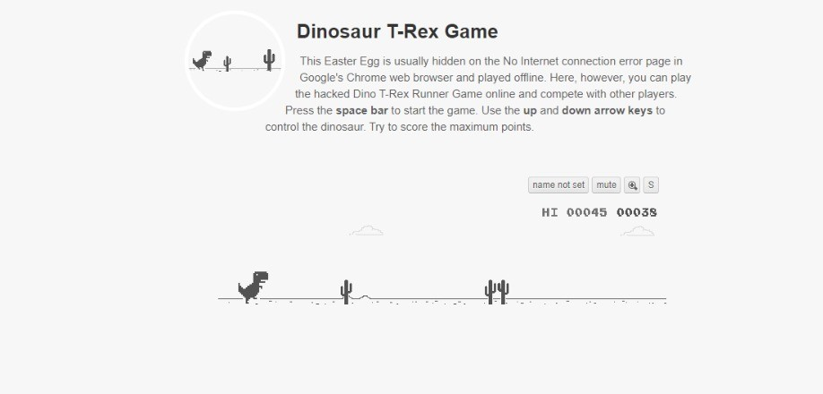

## Telefon:

Da Gerald nicht sprechen kann, haben wir das Telefon über die Windows Your Phone-App mit dem Laptop verbunden. Damit kann er sein Telefon am Computer benutzen (SMS schreiben / Anruf tätigen).

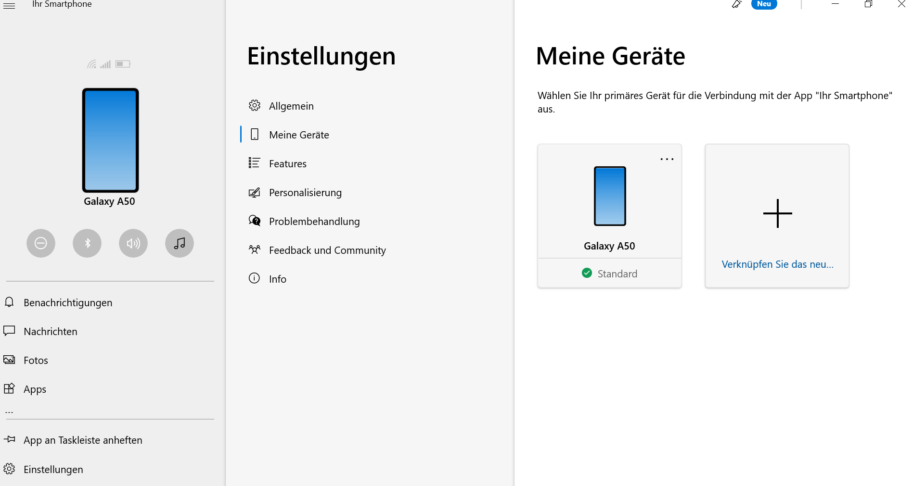

# Der Aufbau

Um das System als Ganzes einzubinden, hat man den Laptop auf einen Beistelltisch gemeinsam mit dem TOBII-Eyetracker positioniert. Die beiden Buttons sind je nach Einschränkung zu montieren. In diesem Fall ein Button unten bei der großen Zehe und einer beim rechten Arm. 

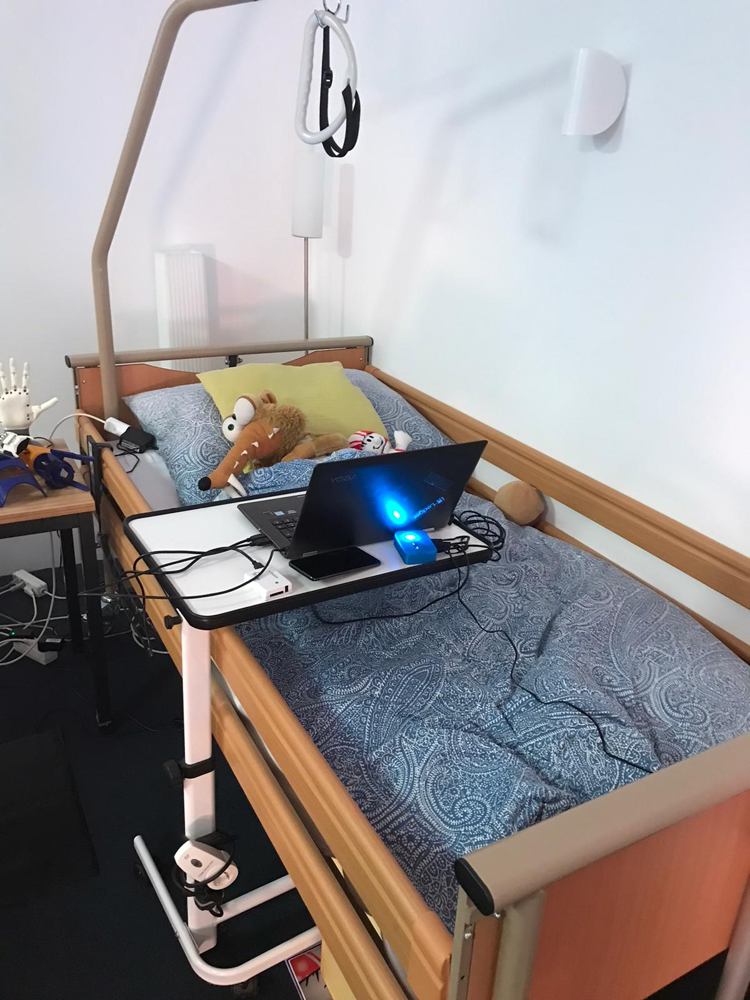

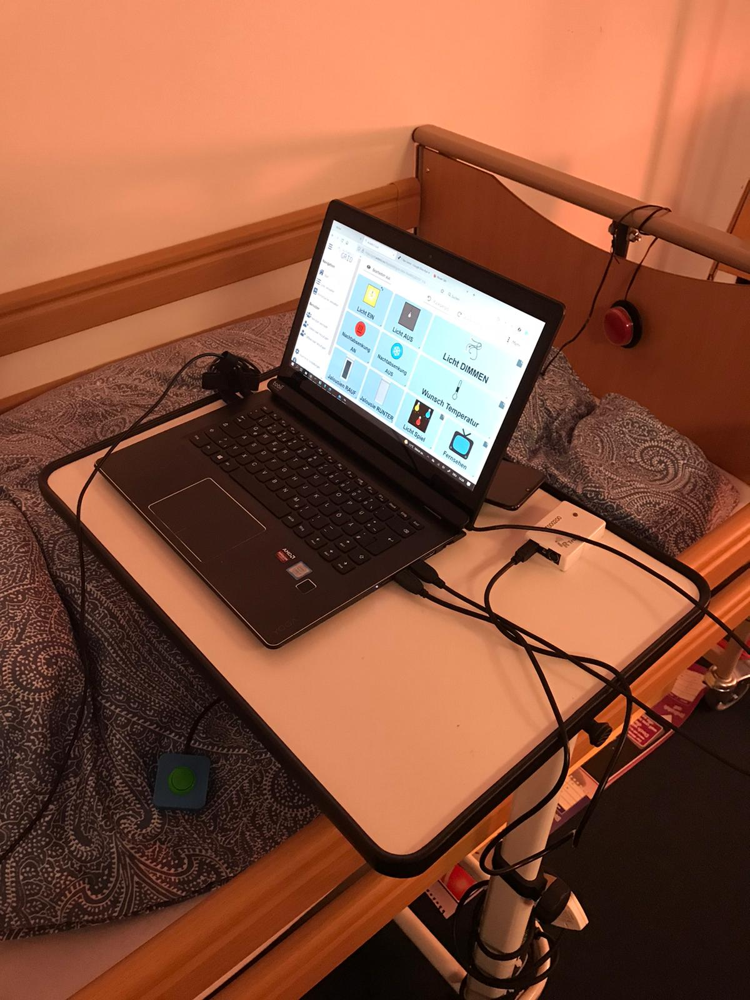

