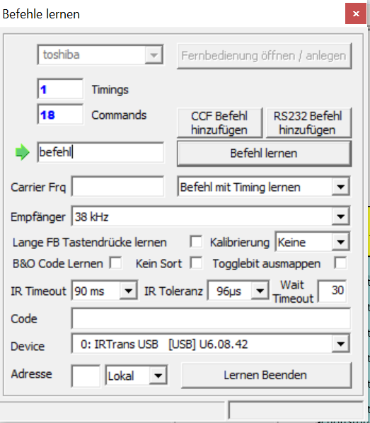

#  AT - Labor
## Use Case Gerald
#
#
#
#### Aufgabenstellung
Die Aufgabe war es, technische Lösungen für die Wünsche von Gerald unter Einbeziehung der gewählten Räume zu entwickeln bzw. anzuwenden. 
Der gewählte Raum ist das Schlafzimmer. 

#### Kurzbeschreibung Klient: Gerald
Gerald hat eine starke körperliche Einschränkung und eine Hörbeeinträchtigung. Er ist auf Pflege angewiesen und kann
Klänge wahrnehmen. Er würde gerne eine gewisse Autonomie zurückerlangen und seine Umgebung (z.B. Licht, Jalousien,
Musik) steuern können. Darüberhinaus würde er gerne Klänge/Visuals erzeugen können und sich die Zeit mit
Computerspielen vertreiben. Er möchte gerne im Internet surfen oder am Smartphone mit seinen Freunden kommunizieren
können.

#### Lösungsansätze
    
    - AsTeRICs Grid
    - IRTrans
    - Eingabegerät FABI
    - Eingabegerät Tobi
    - Betriebsystemeinstellungen für Accessibility
    
# AsTeRICs Grid
Asterics Grid ist eine freie Software für ACC-Anwendungen. Durch dieses webbasierte Tool ist es möglich,  Klientenspezifische Lösungen zu kreiren und dadurch den Lebensstandard von Personen mit gewissen Einschränkungen zu erhöhen. Im Zusammenspiel mit dem AsTeRICS Framework kann die Realisierung zusätzlicher Funktionalitäten wie Umgebungs- oder Computersteuerung ermöglicht werden.  
In diesem Grid-Layout kann man verschiedene und verschieden-viele Elemente hinzufügen. Das Homegrid für den Klienten Gerald hat die wichtigsten Funktionen, wie z.B. Licht und Heizungssteuerung. Weiters kann er den Fernseher bedienen und eine Visual-Smart-Glühbirne steuern. 

Die einzelnen Elemente können individuell eingestellt werden und mit der ACS (Asterics Configuration Suite) kommunizieren. Jedem Element kann eine oder mehrere Aktionen hinzugefügt werden. Für die meisten Elemente wurde eine eigene Asterics-Aktion ausgewählt, welche mit der ACS ausgeführt werden kann. 

    
Um die physischen Umgebungselemente wie Licht, Jalousie, Temperatur, usw. anzusteuern, braucht man ein Tool, welches eine Haussteuerung anbietet. Es wurde das Programm OPENHAB herangezogen, weil es zu diesem Tool ein fertiges Asterics-Plugin gibt. 

    
In openhab kann man seine eigene Homesteuerungswebseite desigen und die entsprechenden Geräte konfigurieren. Für unsere Anwendung wurde das vorgegeben. Als Beispielwebseite ist folgende gezeigt:

    
Wichtig für die Konfiguration ist die richtige IP-Adresse (oder URL). Diese ist unter dem Hostnamen einzutragen. Wenn man auf dem eigenen Rechner bleiben möchte muss man "localhost" eingeben. Ansonsten ist im Living-Lab die URL fhtw-building-control.technikum-wien.at anzugeben. 

Um den Wünschen des Klienten gerecht zu werden, musste die Steuerung des Fernsehers und die der Visual-Glühlampe anwendungsfreundlicher gemacht werden. Dies wurde mit der IRTrans-Komponente realisiert.  Dies ist ein Gerät, welches Infrarot-Befehle "erlernen" kann und so das Senden/Empfangen von IR-Signalen ausführt. 

    
Weiters macht das Plugin "IRTrans" in der ACS das Kommunizieren mit dem Grid wesentlich leichter/schneller. 

In diesem Plugin trägt man die eingelernten Befehle, sowie den Namen der Funktion ein. In diesem Zusammenhang heißt die Funktion (Fernbedienung) "toshiba" und es gibt 18 Arten den Fernseher zu bedienen. 

 

Dieser Befehlsnamen bzw. der dazugehörige String muss dann im Asterics-Grid für das richtige Element eingetragen werden.

    
    
    
